# Pairs Trading & Statistical Arbitrage Engine

A planned modular Python research and backtesting engine for cointegration-based pairs strategies. The project roadmap is in [plan.md](./plan.md).

> **Status:** Planning. The diagram below describes the proposed architecture; the modules have not yet been implemented.

## UML architecture

```mermaid
classDiagram
    direction LR

    class ExperimentConfig {
        +universe
        +date_ranges
        +screening_parameters
        +signal_parameters
        +execution_costs
    }

    class DataLoader {
        +load_prices(universe, date_range)
    }
    class DataValidator {
        +validate(prices)
        +align_pair(prices, symbol_a, symbol_b)
    }
    class PricePanel {
        +timestamp_index
        +symbol_columns
        +adjusted_prices
    }

    class PairScreener {
        +screen(universe, formation_window)
    }
    class CointegrationAnalyzer {
        +estimate_ols(log_price_a, log_price_b)
        +engle_granger(log_price_a, log_price_b)
        +adf(spread)
    }
    class PairModel {
        +symbol_a
        +symbol_b
        +hedge_ratio
        +intercept
        +test_statistics
    }
    class SpreadModel {
        +calculate(prices, pair_model)
        +rolling_zscore(window)
    }

    class SignalStrategy {
        +on_market_event(bar, pair_model)
        +update_state(zscore)
    }
    class PositionState {
        +side
        +entry_time
        +holding_period
    }
    class OrderIntent {
        +symbol
        +target_quantity
        +decision_time
        +reason
    }

    class BacktestEngine {
        +run(prices, config)
        +dispatch(event)
    }
    class EventQueue {
        +next_event()
        +publish(event)
    }
    class ExecutionModel {
        +fill(order, next_bar)
        +calculate_costs(fill)
    }
    class PortfolioLedger {
        +apply_fill(fill)
        +mark_to_market(prices)
        +equity()
    }
    class Fill {
        +timestamp
        +price
        +quantity
        +fees
        +slippage
    }
    class PerformanceReport {
        +calculate_metrics(equity, trades)
        +export(results)
    }

    ExperimentConfig --> DataLoader : configures
    DataLoader --> PricePanel : loads
    PricePanel --> DataValidator : validated by
    DataValidator --> PairScreener : supplies aligned history
    PairScreener --> CointegrationAnalyzer : tests candidate pairs
    CointegrationAnalyzer --> PairModel : estimates
    PairModel --> SpreadModel : defines spread
    PricePanel --> SpreadModel : supplies prices
    SpreadModel --> SignalStrategy : supplies z-score
    PairModel --> SignalStrategy : supplies hedge ratio
    SignalStrategy --> PositionState : updates
    SignalStrategy --> OrderIntent : emits
    BacktestEngine --> EventQueue : processes chronologically
    EventQueue --> SignalStrategy : market events
    EventQueue --> ExecutionModel : order events
    OrderIntent --> ExecutionModel : submitted for next-bar fill
    ExecutionModel --> Fill : creates
    Fill --> PortfolioLedger : updates
    PortfolioLedger --> PerformanceReport : supplies equity and trades
    ExperimentConfig --> BacktestEngine : configures
```

## Intended workflow

1. Load adjusted historical prices and validate timestamps, coverage, and pair alignment.
2. Screen eligible pairs in a formation window using OLS hedge ratios, Engle–Granger cointegration, and ADF diagnostics.
3. Calculate trailing spread z-scores and emit long- or short-spread intents from a stateful strategy.
4. Process market and order events chronologically; execute signals no earlier than the next eligible bar.
5. Update both legs in the portfolio ledger, including commissions, slippage, and any configured borrow costs.
6. Report gross and net performance on validation and untouched out-of-sample periods.

See [plan.md](./plan.md) for implementation phases, assumptions, risk controls, and validation criteria.

## Commit attribution rule

**Strict rule: Do not add Copilot, AI assistants, or other automated agents as commit co-authors.** Commit authorship and co-authorship must represent human contributors only, unless the repository owner explicitly changes this rule.
