# Pairs Trading & Statistical Arbitrage Engine

A modular Python research and event-driven backtesting engine for cointegration-based pairs strategies.

> **Status:** Initial implementation is available. This is a single-pair research simulator, not a live trading system or a claim of profitability.

See [status.md](./status.md) for implementation progress and confirmed bug findings, and [plan.md](./plan.md) for remaining bug-audit and website-deployment tasks.

## UML architecture

```mermaid
classDiagram
    direction LR

    class ExperimentConfig {
        +universe
        +date_ranges
        +screening_parameters
        +signal_parameters
        +execution_costs
    }

    class DataLoader {
        +load_prices(universe, date_range)
    }
    class DataValidator {
        +validate(prices)
        +align_pair(prices, symbol_a, symbol_b)
    }
    class PricePanel {
        +timestamp_index
        +symbol_columns
        +adjusted_prices
    }

    class PairScreener {
        +screen(universe, formation_window)
    }
    class CointegrationAnalyzer {
        +estimate_ols(log_price_a, log_price_b)
        +engle_granger(log_price_a, log_price_b)
        +adf(spread)
    }
    class PairModel {
        +symbol_a
        +symbol_b
        +hedge_ratio
        +intercept
        +test_statistics
    }
    class PairRefit {
        +timestamp
        +lookback_start
        +lookback_end
        +hedge_ratio
    }
    class SpreadModel {
        +calculate(prices, pair_model)
        +rolling_zscore(window)
    }

    class SignalStrategy {
        +on_market_event(bar, pair_model)
        +update_state(zscore)
    }
    class PositionState {
        +side
        +entry_time
        +holding_period
    }
    class OrderIntent {
        +symbol
        +target_quantity
        +decision_time
        +reason
    }

    class BacktestEngine {
        +run(prices, config)
        +dispatch(event)
    }
    class EventQueue {
        +next_event()
        +publish(event)
    }
    class ExecutionModel {
        +fill(order, next_bar)
        +calculate_costs(fill)
    }
    class PortfolioLedger {
        +apply_fill(fill)
        +mark_to_market(prices)
        +equity()
    }
    class Fill {
        +timestamp
        +price
        +quantity
        +fees
        +slippage
    }
    class PerformanceReport {
        +calculate_metrics(equity, trades)
        +export(results)
    }

    ExperimentConfig --> DataLoader : configures
    DataLoader --> PricePanel : loads
    PricePanel --> DataValidator : validated by
    DataValidator --> PairScreener : supplies aligned history
    PairScreener --> CointegrationAnalyzer : tests candidate pairs
    CointegrationAnalyzer --> PairModel : estimates
    BacktestEngine --> PairRefit : records trailing OLS refits while flat
    PairRefit --> PairModel : updates coefficients
    PairModel --> SpreadModel : defines spread
    PricePanel --> SpreadModel : supplies prices
    SpreadModel --> SignalStrategy : supplies z-score
    PairModel --> SignalStrategy : supplies hedge ratio
    SignalStrategy --> PositionState : updates
    SignalStrategy --> OrderIntent : emits
    BacktestEngine --> EventQueue : processes chronologically
    EventQueue --> SignalStrategy : market events
    EventQueue --> ExecutionModel : order events
    OrderIntent --> ExecutionModel : submitted for next-bar fill
    ExecutionModel --> Fill : creates
    Fill --> PortfolioLedger : updates
    PortfolioLedger --> PerformanceReport : supplies equity and trades
    ExperimentConfig --> BacktestEngine : configures
```



## Intended workflow

1. Load and validate daily adjusted prices, then align each candidate pair without forward filling.
2. Screen only the configured training period using OLS hedge ratios, Engle–Granger tests, and Benjamini–Hochberg adjusted p-values. The residual ADF result is retained as a diagnostic, not used as a replacement cointegration test.
3. Freeze the selected pair and use trailing-only rolling z-scores. Refit OLS on the declared schedule using prices available through that close; hedge ratios are held stable during open trades.
4. Process market events chronologically. A close-time signal can fill only at the next session's open.
5. Apply pair sizing, commissions, slippage, borrow costs, and mark-to-market accounting. Any remaining position is explicitly liquidated at the final close.
6. Export a cash benchmark, gross/no-cost counterfactual, net metrics, trade/fill logs, screening diagnostics, and plots.

## Install

Python 3.11 or newer is required. From the repository root:

```bash
python -m venv .venv
source .venv/bin/activate
python -m pip install -e ".[dev,plots,dashboard]"
```

Run the tests:

```bash
python -m pytest -q
```

## Prepare market data and configure a run

Provide your own properly licensed CSV at `data/raw/prices.csv`. The loader accepts long-format rows with these columns:

| Column | Required | Meaning |
|---|---:|---|
| `timestamp` | Yes | Daily observation date |
| `symbol` | Yes | Asset symbol |
| `adjusted_close` | Yes | Positive close adjusted for splits and distributions |
| `open` | For backtests | Positive next-session execution open, adjusted on the same basis as close |

There is intentionally no market-data download dependency, sample market data, or API credential in this repository. Missing observations are reported and never forward-filled. Invalid numeric values, duplicate symbol/date rows, non-positive prices, or insufficient history are rejected.

Before running the baseline, edit `configs/baseline.yaml`:

- Set `universe` to the symbols to screen, or leave it empty to use every CSV symbol.
- Confirm `data.path` and `data.min_observations`.
- Set `evaluation.train_end` and `evaluation.test_start` to strictly chronological dates; optionally set `test_end`.
- Keep the test period untouched during pair/parameter selection.

Run from the repository root:

```bash
python -m pairs_trading --config configs/baseline.yaml --output results/baseline
```

The command screens using only data through `train_end`, applies the predeclared Engle–Granger significance level and false-discovery-rate correction, chooses the most significant passing pair, and backtests from `test_start` through `test_end` (or the end of available data). It fails explicitly if no pair passes or the requested data is incomplete.

Generated artifacts include `pair_screening.csv`, `pair_refits.csv`, `experiment_config.yaml`, `equity_curve.csv`, `spread.csv`, `zscore.csv`, `signals.csv`, `fills.csv`, `trades.csv`, `cancelled_orders.csv`, `metrics.json`, and `diagnostics.png`. The gross curve is a no-cost counterfactual; net results deduct configured transaction and borrow costs. The cash benchmark holds initial capital unchanged.

## Visual local test workbench

Start the browser-based workbench from the repository root:

```bash
streamlit run src/pairs_trading/dashboard.py
```

It opens locally (normally at `http://localhost:8501`). Choose **Synthetic demo** to run a deterministic cointegrated example with a reverting test-period dislocation, or choose **Upload CSV** to use your own data. Set the training cutoff, test window, screening window, signal thresholds, and costs, then click **Screen pairs and run out-of-sample test**. The workbench displays every pair's screening diagnostics, equity curves, z-scores, trades, fills, and downloadable CSV/JSON summaries. It only runs locally and does not send, persist, or trade uploaded data.

This workbench is a development aid, not the production website. A separately deployed service will need its own privacy, authentication, data-retention, hosting, and operational decisions.

## Assumptions and limitations

- Screening uses a deterministic alphabetical dependent/independent ordering; Engle–Granger is not symmetric.
- OLS coefficients are periodically refit from trailing history while flat; positions are not silently rebalanced during an open trade.
- Signals are calculated after the close and executed at the next available open. A forced final-close liquidation is recorded as an explicit end-of-data exit.
- Position sizing uses fractional shares and a fixed gross-notional budget based on initial capital. This first release simulates one pair at a time and does not enforce borrow availability, margin rules, portfolio-wide exposure caps, or market impact.
- The baseline workflow uses one chronological training/test boundary. It does not tune parameters on the test period; validation-window selection, automated sensitivity grids, survivorship-free universes, and live execution remain future work.
- Historical cointegration, significance, or returns do not ensure future relationships or profitability.

See [plan.md](./plan.md) for implementation phases, assumptions, risk controls, and validation criteria.

## Commit attribution rule

**Strict rule: Do not add Copilot, AI assistants, or other automated agents as commit co-authors.** Commit authorship and co-authorship must represent human contributors only, unless the repository owner explicitly changes this rule.
