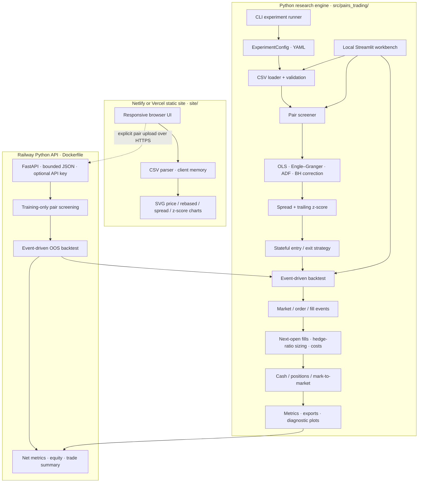
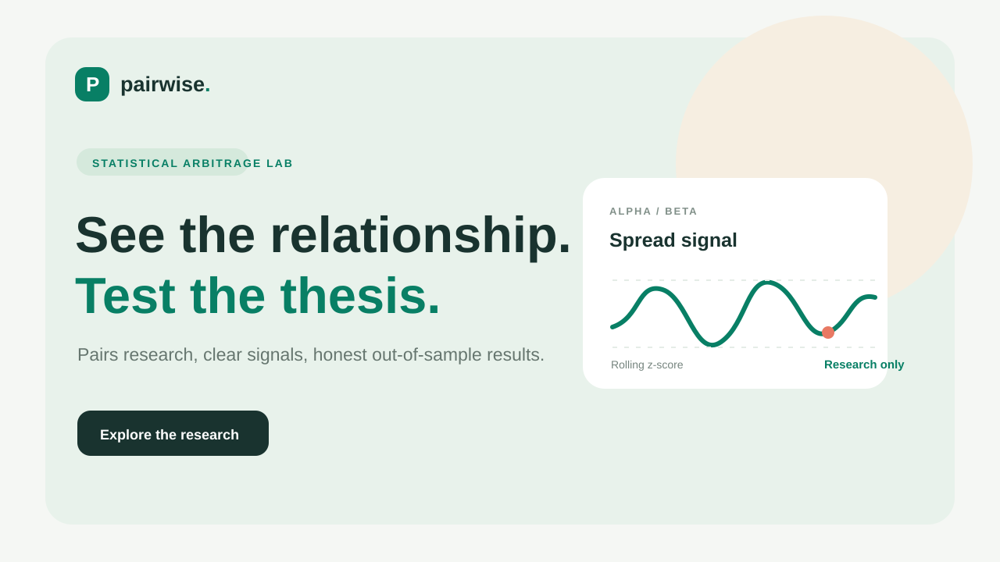

# Pairs Trading & Statistical Arbitrage Engine

A modular Python research and event-driven backtesting engine for cointegration-based pairs strategies.

> **Status:** Local research engine, optional Railway API, and static frontend configurations are available. Cloud deployment still requires account access. This is a research simulator, not a live trading system or a claim of profitability.

See [status.md](./status.md) for implementation progress and confirmed bug findings, and [plan.md](./plan.md) for remaining bug-audit and website-deployment tasks.

## Current architecture



## Intended workflow

1. Load and validate daily adjusted prices, then align each candidate pair without forward filling.
2. Screen only the configured training period using OLS hedge ratios, Engle–Granger tests, and Benjamini–Hochberg adjusted p-values. The residual ADF result is retained as a diagnostic, not used as a replacement cointegration test.
3. Freeze the selected pair and use trailing-only rolling z-scores. Refit OLS on the declared schedule using prices available through that close; hedge ratios are held stable during open trades.
4. Process market events chronologically. A close-time signal can fill only at the next session's open.
5. Apply pair sizing, commissions, slippage, borrow costs, and mark-to-market accounting. Any remaining position is explicitly liquidated at the final close.
6. Export a cash benchmark, gross/no-cost counterfactual, net metrics, trade/fill logs, screening diagnostics, and plots.

## Install

Python 3.11 or newer is required. From the repository root:

```bash
python -m venv .venv
source .venv/bin/activate
python -m pip install -e ".[dev,plots,dashboard,backend]"
```

Run the tests:

```bash
python -m pytest -q
```

## Prepare market data and configure a run

Provide your own properly licensed CSV at `data/raw/prices.csv`. The loader accepts long-format rows with these columns:

| Column | Required | Meaning |
|---|---:|---|
| `timestamp` | Yes | Daily observation date |
| `symbol` | Yes | Asset symbol |
| `adjusted_close` | Yes | Positive close adjusted for splits and distributions |
| `open` | For backtests | Positive next-session execution open, adjusted on the same basis as close |

There is intentionally no market-data download dependency, sample market data, or API credential in this repository. Missing observations are reported and never forward-filled. Invalid numeric values, duplicate symbol/date rows, non-positive prices, or insufficient history are rejected.

Before running the baseline, edit `configs/baseline.yaml`:

- Set `universe` to the symbols to screen, or leave it empty to use every CSV symbol.
- Confirm `data.path` and `data.min_observations`.
- Set `evaluation.train_end` and `evaluation.test_start` to strictly chronological dates; optionally set `test_end`.
- Keep the test period untouched during pair/parameter selection.

Run from the repository root:

```bash
python -m pairs_trading --config configs/baseline.yaml --output results/baseline
```

The command screens using only data through `train_end`, applies the predeclared Engle–Granger significance level and false-discovery-rate correction, chooses the most significant passing pair, and backtests from `test_start` through `test_end` (or the end of available data). It fails explicitly if no pair passes or the requested data is incomplete.

Generated artifacts include `pair_screening.csv`, `pair_refits.csv`, `experiment_config.yaml`, `equity_curve.csv`, `spread.csv`, `zscore.csv`, `signals.csv`, `fills.csv`, `trades.csv`, `cancelled_orders.csv`, `metrics.json`, and `diagnostics.png`. The gross curve is a no-cost counterfactual; net results deduct configured transaction and borrow costs. The cash benchmark holds initial capital unchanged.

## Visual local test workbench

Start the browser-based workbench from the repository root:

```bash
streamlit run src/pairs_trading/dashboard.py
```

It opens locally (normally at `http://localhost:8501`). Choose **Synthetic demo** to run a deterministic cointegrated example with a reverting test-period dislocation, or choose **Upload CSV** to use your own data. Set the training cutoff, test window, screening window, signal thresholds, and costs, then click **Screen pairs and run out-of-sample test**. The workbench displays every pair's screening diagnostics, equity curves, z-scores, trades, fills, and downloadable CSV/JSON summaries. It only runs locally and does not send, persist, or trade uploaded data.

This Streamlit workbench runs the actual Python engine locally.

## Static website and Railway backtest API

The responsive static explorer in [`site/`](./site/) supports both Netlify and Vercel:

- Netlify reads [`netlify.toml`](./netlify.toml), which publishes `site/`.
- Vercel reads [`vercel.json`](./vercel.json), which sets the output directory to `site/`.

Import this repository on either platform and deploy the `main` branch from the repository root. The browser generates a deterministic business-day demo or reads a user-selected CSV, then draws adjusted prices, rebased prices, a log-price spread, and rolling z-scores. Those charts are calculated locally. A Python backtest is only sent after the user enters the Railway API URL (and API key if configured) and presses **Screen & backtest**.

### Run the Railway API locally

Install the backend extra and start the HTTP service:

```bash
python -m pip install -e ".[backend]"
uvicorn pairs_trading.api:app --host 127.0.0.1 --port 8000
```

The service exposes `GET /healthz` and `POST /api/v1/backtest`. It validates the submitted pair, runs Engle–Granger screening strictly through `train_end`, and only backtests later observations with next-open execution and configured costs. It returns the training diagnostic, out-of-sample metrics, equity points, and completed trades. The API writes no uploaded market rows to disk.

The API accepts at most 40,000 selected-pair rows and 8 MiB per request. It requires `timestamp`, `symbol`, positive `adjusted_close`, and positive `open` prices; at least 100 aligned training dates and a later test period are required by the website. The local chart explorer still works with CSVs that omit `open`, but the backtest action will require it.

### Deploy the Python API on Railway

Create a Railway service from this repository. Railway detects the root [`Dockerfile`](./Dockerfile), which installs the `backend` extra and binds Uvicorn to Railway's injected `PORT`. The API has a public healthcheck at `/healthz`.

Set these Railway service variables before making the service public:

| Variable | Value |
|---|---|
| `CORS_ORIGINS` | Exact website origin(s), comma-separated, e.g. `https://your-site.vercel.app` |
| `API_TOKEN` | A unique, high-entropy secret; do not commit it or paste it into source control |

`API_TOKEN` is optional for local development. When set on Railway, the backtest endpoint requires the `X-API-Key` header; the browser's password field sends the key only for the current request and does not save it. Keep `CORS_ORIGINS` restricted to the deployed frontend origins. CORS is not a substitute for the API key or resource limits.

After Railway issues an HTTPS domain, paste its base URL and (if enabled) the API key into the static site's **Out-of-sample backtest** panel. The browser submits only the selected pair when asked; CSV charting otherwise stays client-side. For large inputs, use fewer than the 40,000-row/8-MiB limits.

### Local static-site preview

```bash
python -m http.server 4173 --directory site
```

Open `http://localhost:4173`. The page has no build step and does not load charting libraries, market-data APIs, or fonts from third parties. To run the hosted-backtest flow against a local API, set `CORS_ORIGINS=http://127.0.0.1:4173` when starting Uvicorn and enter `http://127.0.0.1:8000` in the panel.

### Deployment state

The static-host and Railway configurations are prepared, but no cloud service has been deployed yet. Deployment requires authenticated Vercel or Netlify and Railway accounts. Those CLIs are not installed or authenticated in the current environment; no credentials are stored in this repository.

### Why data may appear not to load

- Neither UI downloads market data automatically. The Python workbench creates synthetic demo data, or the user must upload a CSV. The static site also starts with generated demo prices and only reads a real CSV after **Choose price file**.
- The Python upload expects long-format rows with exact column names `timestamp`, `symbol`, `adjusted_close`, and `open`. `open` is required for next-session execution; uploaded files remain in memory.
- Headers using another spelling, wide-format price tables, duplicate symbol/date rows, non-positive/non-numeric prices, missing history, or fewer than 20 common dates are rejected with an error instead of being imputed.
- The static explorer only needs `timestamp`, `symbol`, and `adjusted_close` for charts. A Python API backtest also needs valid `open` prices.
- The static page cannot read `data/raw/prices.csv` from the Git checkout or your computer automatically. Select a file explicitly; browser filesystem isolation prevents silent local-file access. Data stays in the browser unless **Screen & backtest** is explicitly pressed.

If no actual dataset was selected, the interface will say so; a successful demo or CSV load displays its row count, symbols, and date range. The Railway API URL, CORS origins, and API key must match the account's deployed service settings.

## Short product tour

[](assets/pairwise-product-tour.mp4)

[Open or download the 11-second MP4 product tour](assets/pairwise-product-tour.mp4). It is a branded, silent overview of the browser workspace, training-only screening, and cost-aware out-of-sample workflow.

## Assumptions and limitations

- Screening uses a deterministic alphabetical dependent/independent ordering; Engle–Granger is not symmetric.
- OLS coefficients are periodically refit from trailing history while flat; positions are not silently rebalanced during an open trade.
- Signals are calculated after the close and executed at the next available open. A forced final-close liquidation is recorded as an explicit end-of-data exit.
- Position sizing uses fractional shares and a fixed gross-notional budget based on initial capital. This first release simulates one pair at a time and does not enforce borrow availability, margin rules, portfolio-wide exposure caps, or market impact.
- The baseline workflow uses one chronological training/test boundary. It does not tune parameters on the test period; validation-window selection, automated sensitivity grids, survivorship-free universes, and live execution remain future work.
- Historical cointegration, significance, or returns do not ensure future relationships or profitability.

See [plan.md](./plan.md) for implementation phases, assumptions, risk controls, and validation criteria.

## Commit attribution rule

**Strict rule: Do not add Copilot, AI assistants, or other automated agents as commit co-authors.** Commit authorship and co-authorship must represent human contributors only, unless the repository owner explicitly changes this rule.
